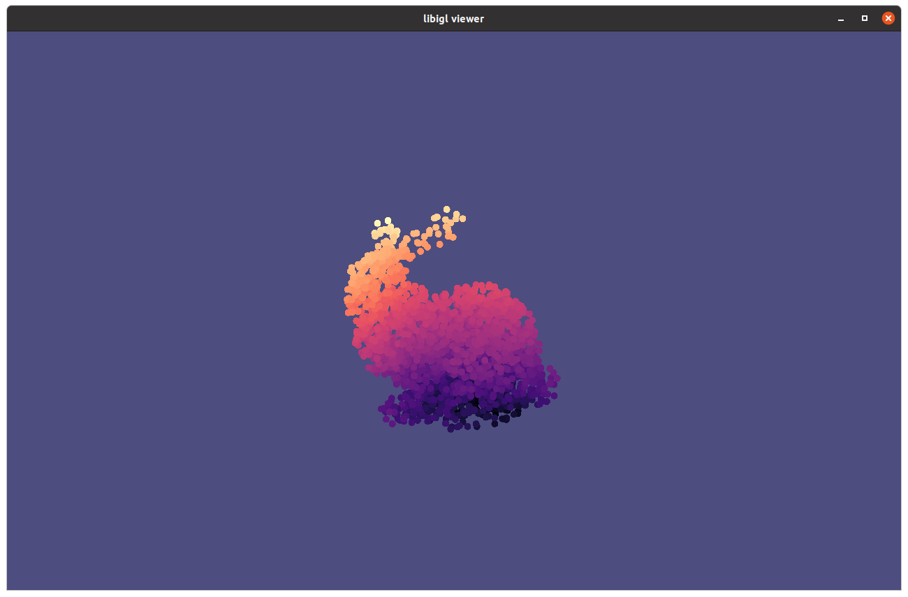
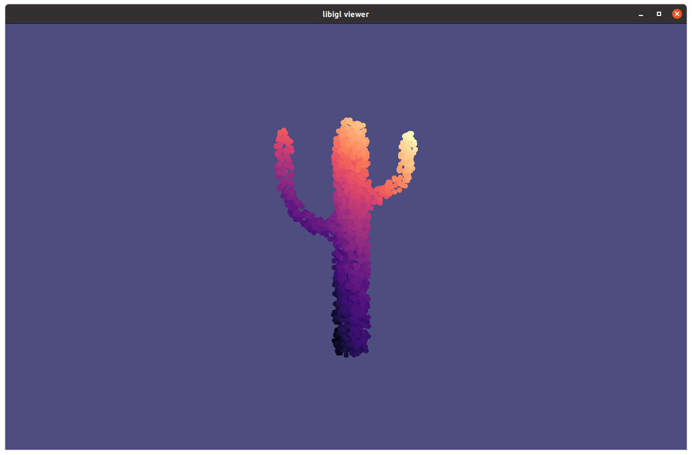
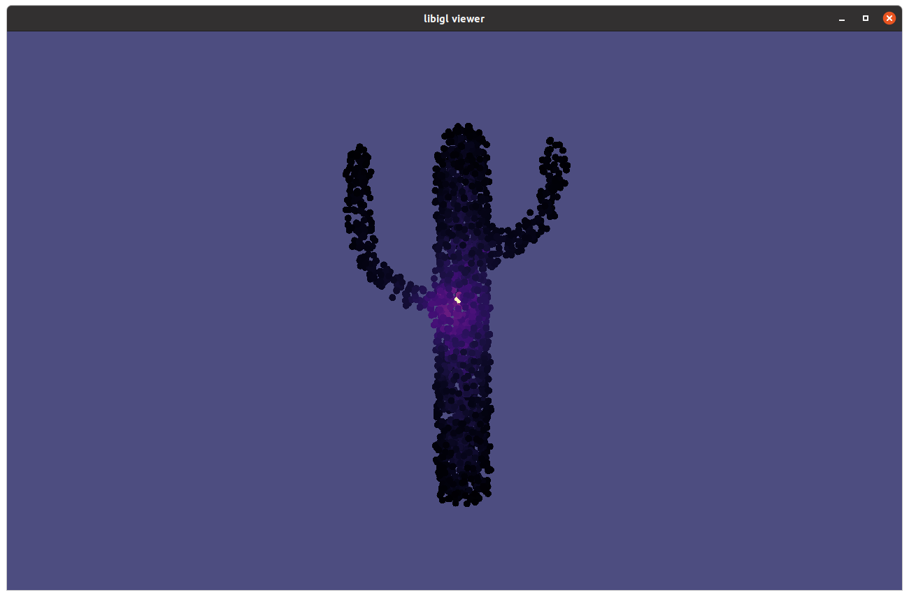
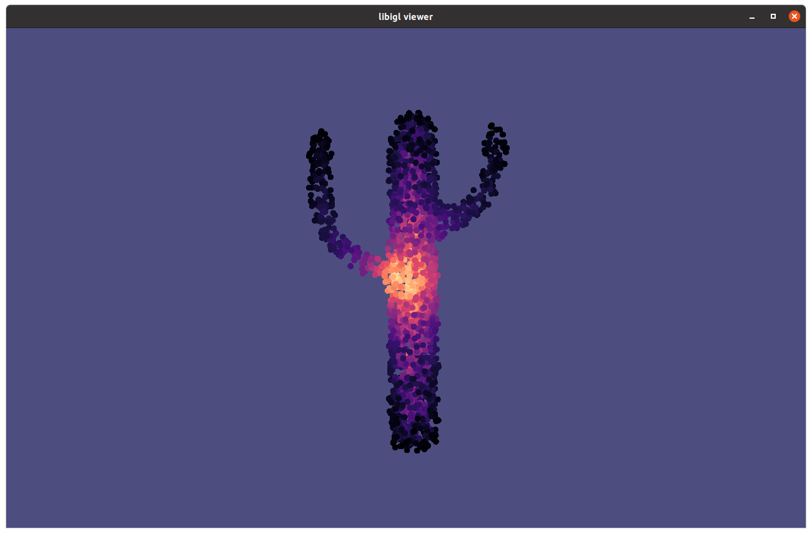
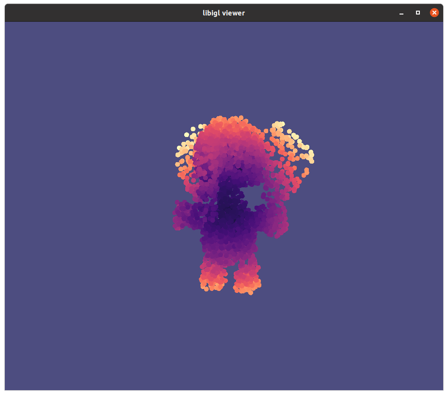

## Monte Carlo Geometry Processing

PDE-based methods are widely used in geometry processing problems, such as smoothing (laplace), reconstruction(poisson), deformation (biharmonic equation), etc. The Monte Carlo PDE estimator provides a novel way to solve partial differential equations.

The Monte Carlo PDE estimator computes the solution to a partial differential equation at some given point with the Walk on Spheres(WoS) algorithm.

### Laplace Equation

For a Laplace equation given by 
$$ \Delta u = 0 \ \ \ on \ \ \Omega$$
$$ u = g \ \ \ on \ \ \partial\Omega$$
The WoS algorithm is done iteratively, for an iteration k:
1. At $x_k$, find the largest sphere $S(x_k)$ centered at $x_k$ inscribed in the mesh
2. Pick a random point $x_{k+1}$ on $S(x_k)$

Repeat step 1 and 2 until $x_k$ is close to the mesh, i.e. $d(x_k, V, F) < \epsilon$ 
Give an estimate for $u(x_0)$ as $\hat{u}(x_0)$ = $g(\bar{x_K})$, where $\bar{x_K}$ is the closest point on mesh to $x_K$

This estimator can be used as follows:
Eigen::MatrixXd U;
walk_on_spheres_3D(V, F, B, P, U);
Where $B$ is a function $\mathbb{R}^3 \rightarrow \mathbb{R}$ that can be evaluated on points on mesh. $P$ is a set of Query points (not necessarily part of any mesh).

<table><tr>
<td>  </td>
<td>  </td>
</tr></table>

Figure 1. Solved laplace with the boundary condition $g(x) = \|x\|_2$ 

### Poisson Equation

For a Poisson equation given by
$$\Delta u = f \ \ \ on \ \ \Omega$$
$$u = g \ \ \ on\ \  \partial\Omega$$

The WoS algorithm is similar to the one for Laplace, except for an iteration k, it has an extra step:
3. Pick a random point $y_k$ in the largest ball $B(x_k)$ centered at $x_k$ inscribed in the mesh

And the estimate for $u(x_0)$ is $\hat{u}(x_0) = g(\bar{x_K}) + \Sigma_{i=1}^K |B(x_i)|f(y_i)G(x_i, y_i)$

This estimator can be used as follows:
Eigen::MatrixXd U;
walk_on_spheres_poisson(V, F, B, f, P, U);
Where $f:\mathbb{R}^3 \rightarrow \mathbb{R}$ is a source function that can be specified by the user.

#### Importance Sampling

For a specific type of source function $f_z = c \delta_z$, where c is a constant and 
$\delta_z$ is the Dirac delta centered at a point $z\in \Omega$, we can instead sample $y_k$ in the following way:

3*. If $x_k$ is close enough to the source point $z$ $(z\in B(x_k))$, use the following term for the contribution

$$|B(x_k)|\frac{f(z)G(x,z)}{p(z)} = |B(x_k)|\frac{c \delta_z G(x, z)}{\delta_z} = |B(x_k)|c G(x, z)$$

Otherwise use the normal poisson contribution $|B(x_k)|f(y_k)G(x_k, y_k)$.  

To use importance sampling, set the optional source point, c, and use_importance:
walk_on_spheres_poisson(V, F, B, f, P, U, z, c, use_importance=true);
<table><tr>
<td>  </td>
<td>  </td>
</tr></table>

Figure 2. Left: importance sampling with c=10000, sourcePoint=(0.5, 0.5, 0.5); Right: no importance sampling  
where $g(x)=1/\|x-z\|_2$, $f=c\delta_z \propto e^{-\|x-z\|^2}$

#### Screened Poisson Equation

A variant of the Poisson equation introduces a linear $u$ term
$$\begin{align} \Delta u - cu &= f \ \ \ on \ \ \Omega \\ u &= g \ \ \ on\ \  \partial\Omega \end{align}$$
which can be solved using a similar method to the poisson equation except the harmonic Green's function G(x, y) is replaced by $Yukawa\ potential$.

### Biharmonic Equation

The biharmonic equation given by
$$\begin{align} \Delta^2 u &= 0 \ \ \ on \ \ \Omega \\ u &= g \ \ \ on\ \  \partial\Omega \\ \Delta u &= h \ \ \ on\ \  \partial\Omega \end{align}$$ 

The equation be simplified into a system of pdes using the substitution $v := \Delta u$ 

$$\Delta u =v \ \ \ on \ \ \Omega \ \ \ \ \ \Delta v = 0 \ \ \ on\ \  \Omega $$
$$\ u =g \ \ \ on \ \ \partial \Omega \ \ \ \ \ \  v=h \ \ \ on\ \  \partial\Omega$$

The equation can be solved similar to the method of solving a poisson equation, except in step 3, we evaluate $f(y_k):=v(y_k)$ by $h(\bar{x_K})$ where $x_K$ is the final point in the walk for solving $u$.

This estimator can be used as: 
walk_on_spheres_biharmonic(V, F, B, h, P, U);
where $B, h: \mathbb{R}^3 \rightarrow \mathbb{R}$ are boundary condition functions.

<table><tr>
<td>  </td>
<td>  </td>
</tr></table>

Figure 3. solve biharmonic with boundary conditions $g(x)=\|x - center\|^4$, $h(x)=x(0)$

### Remark

The Monte Carlo method has the advantage of requiring less information of the shape than the finite-element method. It only needs a bounding volume hierarchy of shape and a set of boundary points/edges/polygon soup. However, we find it hard to apply this method directly on a 2D surface (more specifically, a 2D manifold without boundary) in 3D where it's uncertain to define a ball/sphere inscribed inside the "boundary".

### References

Sawhney, Rohan and Keenan Crane. “Monte Carlo geometry processing.” ACM Transactions on Graphics (TOG) 39 (2020): 123:1 - 123:18.  
Poisson Equation: https://en.wikipedia.org/wiki/Poisson%27s_equation #Potential of a Gaussian charge density  
Biharmonic Equation: https://mathworld.wolfram.com/BiharmonicEquation.html  
